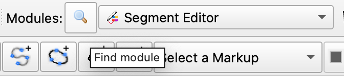
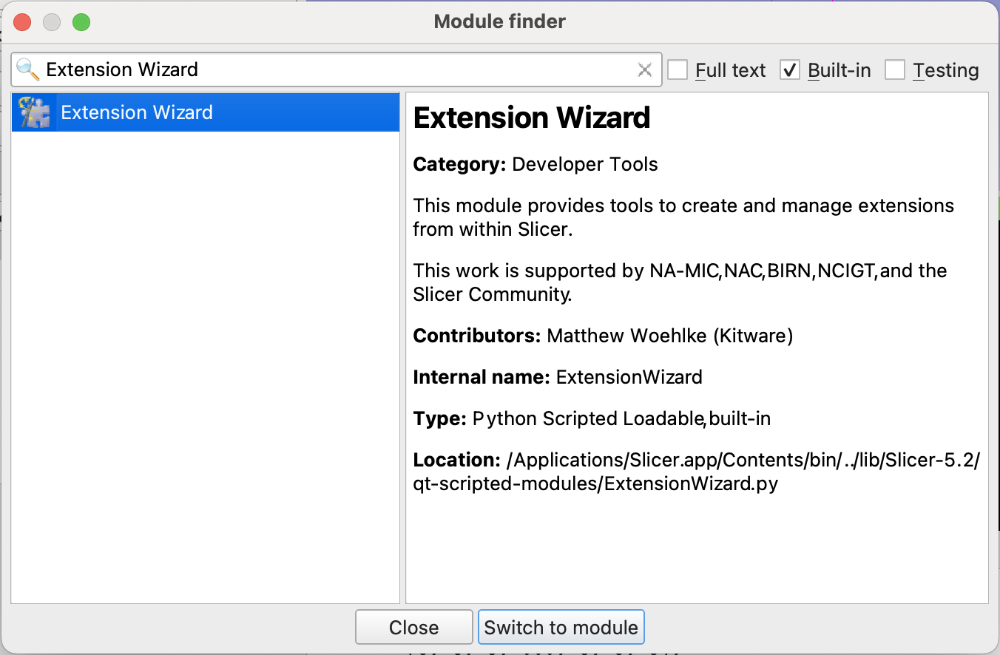
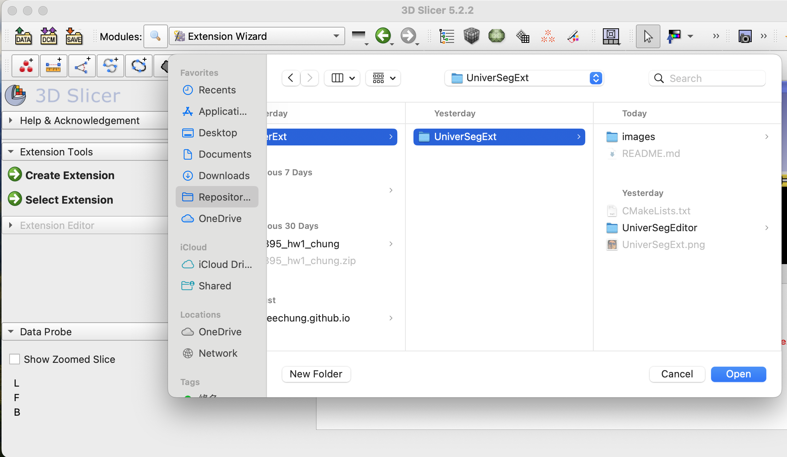
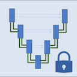
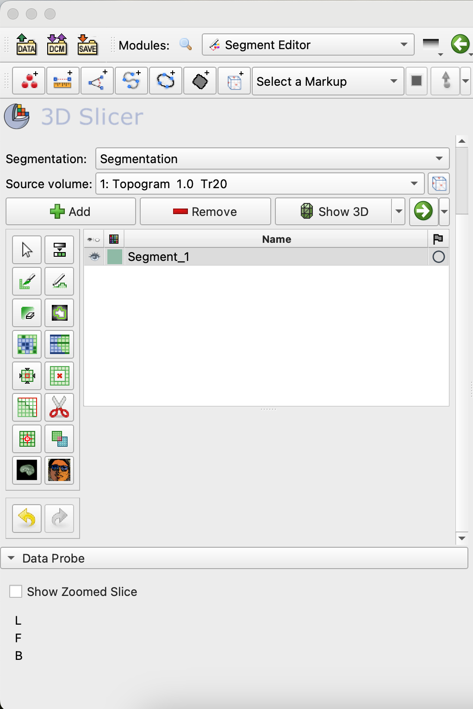

# UniverSegExt

This repository is an extension 3D slicer. Follow the steps below, and install this extension on your sclicer' segment editor.

## Installation
1. Download this [repo](https://github.com/garyeechung/universegext.git).
   or use `git clone https://github.com/garyeechung/universegext.git`
2. Open your **3D Slicer** and go to **Module Finder**
   
3. Look for **Extension Wizard** and switch to it.
   
4. CLick **Select Extension** and open `the/directory/to/the/downloaded/extension`
   
5. Restart 3D slicer, then you will find it in **Segment Editor** with an icon like this .
   